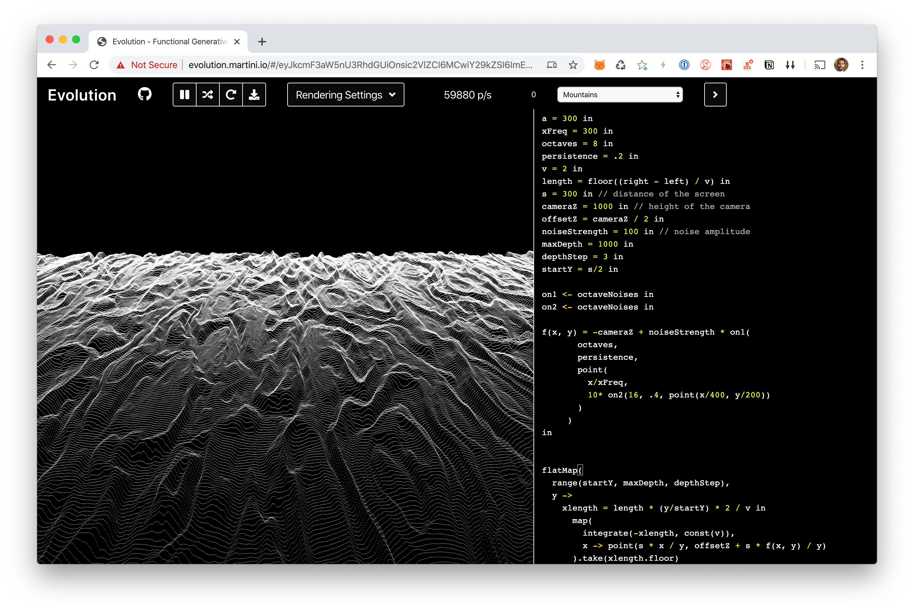
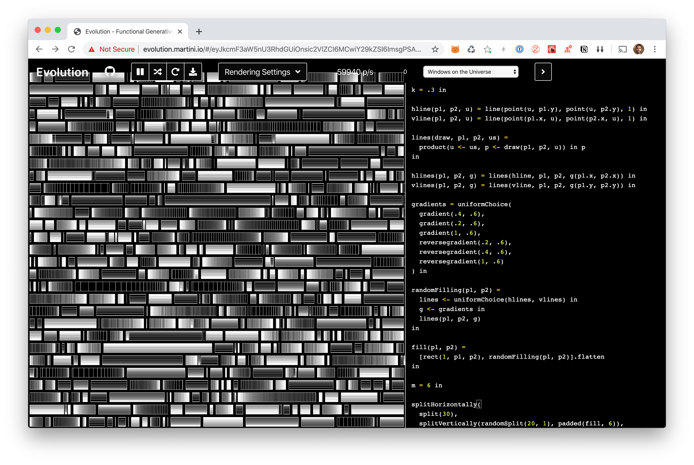
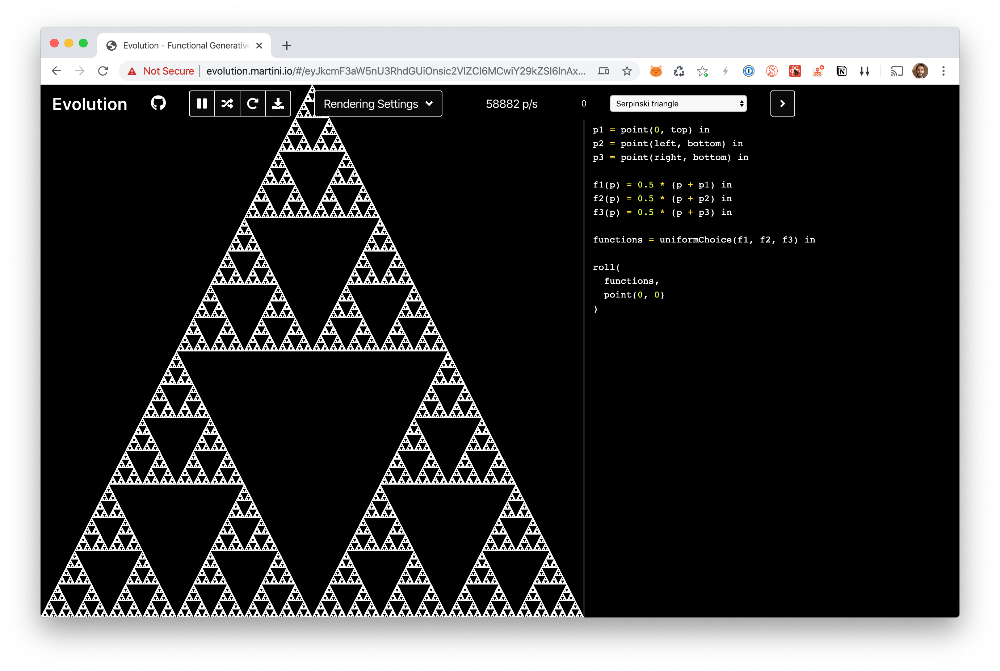

# Evolution 
[Evolution](https://evolution.martini.io) is a language and an app to define and draw generative artworks in your browser, written in Scala 3.

## Examples
[Random Walk](http://evolution.martini.io/#/eyJkcmF3aW5nU3RhdGUiOnsic2VlZCI6Nzc1MTMzODM5ODA1MDM2NTQ0OCwiY29kZSI6InJhbmRvbVdhbGsoMikifSwicmVuZGVyZXJTdGF0ZSI6eyJpdGVyYXRpb25zIjoxMDAwLCJzdHJva2VTaXplIjoxLCJyZXNvbHV0aW9uRmFjdG9yIjoyLCJ0cmFpbCI6eyJhY3RpdmUiOmZhbHNlLCJvcGFjaXR5IjowLjEyfSwib2ZmQ2FudmFzU2V0dGluZ3MiOnsiVG9ydXNDYW52YXMiOnt9fX19)

[Smoke](http://evolution.martini.io/#/eyJkcmF3aW5nU3RhdGUiOnsic2VlZCI6ODE3Mzk1MTkyODkwNDg3MjQ2LCJjb2RlIjoicmFkaXVzID0gLjQgIGluXG52aXNjb3NpdHkgPSAwLjAwMDMgaW5cbmsgPSAuNiBpblxuc3RlcCA9IDIgaW5cblxuaW50ZWdyYXRlKFxuICBwb2ludCgwLCAwKSxcbiAgc3RlcCAqIGRhbXBlZE9zY2lsbGF0b3IoLWssIC12aXNjb3NpdHksIHVuaWZvcm1Qb2ludChyYWRpdXMpKVxuKSJ9LCJyZW5kZXJlclN0YXRlIjp7Iml0ZXJhdGlvbnMiOjEwMDAsInN0cm9rZVNpemUiOjEsInJlc29sdXRpb25GYWN0b3IiOjIsInRyYWlsIjp7ImFjdGl2ZSI6ZmFsc2UsIm9wYWNpdHkiOjAuMTJ9LCJvZmZDYW52YXNTZXR0aW5ncyI6eyJUb3J1c0NhbnZhcyI6e319fX0=)

[Mountains](http://evolution.martini.io/#/eyJkcmF3aW5nU3RhdGUiOnsic2VlZCI6MCwiY29kZSI6ImEgPSAzMDAgaW5cbnhGcmVxID0gMzAwIGluXG5vY3RhdmVzID0gOCBpblxucGVyc2lzdGVuY2UgPSAuMiBpblxudiA9IDIgaW5cbmxlbmd0aCA9IGZsb29yKChyaWdodCAtIGxlZnQpIC8gdikgaW5cbnMgPSAzMDAgaW4gLy8gZGlzdGFuY2Ugb2YgdGhlIHNjcmVlblxuY2FtZXJhWiA9IDEwMDAgaW4gLy8gaGVpZ2h0IG9mIHRoZSBjYW1lcmFcbm9mZnNldFogPSBjYW1lcmFaIC8gMiBpblxubm9pc2VTdHJlbmd0aCA9IDEwMCBpbiAvLyBub2lzZSBhbXBsaXR1ZGVcbm1heERlcHRoID0gMTAwMCBpblxuZGVwdGhTdGVwID0gMyBpblxuc3RhcnRZID0gcy8yIGluXG5cbm9uMSA8LSBvY3RhdmVOb2lzZXMgaW5cbm9uMiA8LSBvY3RhdmVOb2lzZXMgaW5cblxuZih4LCB5KSA9IC1jYW1lcmFaICsgbm9pc2VTdHJlbmd0aCAqIG9uMShcbiAgICAgICBvY3RhdmVzLFxuICAgICAgIHBlcnNpc3RlbmNlLFxuICAgICAgIHBvaW50KFxuICAgICAgICAgeC94RnJlcSxcbiAgICAgICAgIDEwKiBvbjIoMTYsIC40LCBwb2ludCh4LzQwMCwgeS8yMDApKVxuICAgICAgIClcbiAgICAgKVxuaW5cblxuXG5mbGF0TWFwKFxuICByYW5nZShzdGFydFksIG1heERlcHRoLCBkZXB0aFN0ZXApLFxuICB5IC0+XG4gICAgeGxlbmd0aCA9IGxlbmd0aCAqICh5L3N0YXJ0WSkgKiAyIC8gdiBpblxuICAgICAgbWFwKFxuICAgICAgICBpbnRlZ3JhdGUoLXhsZW5ndGgsIGNvbnN0KHYpKSxcbiAgICAgICAgeCAtPiBwb2ludChzICogeCAvIHksIG9mZnNldFogKyBzICogZih4LCB5KSAvIHkpXG4gICAgICApLnRha2UoeGxlbmd0aC5mbG9vcilcbikifSwicmVuZGVyZXJTdGF0ZSI6eyJpdGVyYXRpb25zIjoxMDAwLCJzdHJva2VTaXplIjoxLCJyZXNvbHV0aW9uRmFjdG9yIjoyLCJ0cmFpbCI6eyJhY3RpdmUiOmZhbHNlLCJvcGFjaXR5IjowLjEyfSwib2ZmQ2FudmFzU2V0dGluZ3MiOnsiSW5maW5pdGVDYW52YXMiOnt9fX19)

[Webified Random Walk](http://evolution.martini.io/#/eyJkcmF3aW5nU3RhdGUiOnsic2VlZCI6MCwiY29kZSI6ImQgPSAxMCBpblxuciA9IDgwIGluXG5sZW5ndGggPSAxMDAwMDAgaW5cblxud2ViaWZ5KGV2bykgPVxuICBmIDwtIGV2by5wYXJhbWV0cml6YXRpb25zKGxlbmd0aCkgaW5cbiAgaW50ZWdyYXRlKDAsIHVuaWZvcm0oLXIsIHIpKS5zbGlkaW5nTWFwKFxuICAgIHQxIC0+IHQyIC0+IGxpbmUoZih0MSksIGYodDIpLCAxKVxuICApLmZsYXR0ZW5cbmluXG5cblxuaW50ZWdyYXRlKHBvaW50KDAsIDApLCBAcG9pbnQodW5pZm9ybSgtZCwgZCksIHVuaWZvcm0oLWQsIGQpKSkud2ViaWZ5In0sInJlbmRlcmVyU3RhdGUiOnsiaXRlcmF0aW9ucyI6MTAwMCwic3Ryb2tlU2l6ZSI6MSwicmVzb2x1dGlvbkZhY3RvciI6MiwidHJhaWwiOnsiYWN0aXZlIjpmYWxzZSwib3BhY2l0eSI6MC4xMn0sIm9mZkNhbnZhc1NldHRpbmdzIjp7IkluZmluaXRlQ2FudmFzIjp7fX19fQ==)

[Gradients](http://evolution.martini.io/#/eyJkcmF3aW5nU3RhdGUiOnsic2VlZCI6MCwiY29kZSI6ImsgPSAuMyBpblxuXG5obGluZShwMSwgcDIsIHUpID0gbGluZShwb2ludCh1LCBwMS55KSwgcG9pbnQodSwgcDIueSksIDEpIGluXG52bGluZShwMSwgcDIsIHUpID0gbGluZShwb2ludChwMS54LCB1KSwgcG9pbnQocDIueCwgdSksIDEpIGluXG5cbmxpbmVzKGRyYXcsIHAxLCBwMiwgdXMpID1cbiAgcHJvZHVjdCh1IDwtIHVzLCBwIDwtIGRyYXcocDEsIHAyLCB1KSkgaW4gcFxuaW5cblxuaGxpbmVzKHAxLCBwMiwgZykgPSBsaW5lcyhobGluZSwgcDEsIHAyLCBnKHAxLngsIHAyLngpKSBpblxudmxpbmVzKHAxLCBwMiwgZykgPSBsaW5lcyh2bGluZSwgcDEsIHAyLCBnKHAxLnksIHAyLnkpKSBpblxuXG5ncmFkaWVudHMgPSB1bmlmb3JtQ2hvaWNlKFxuICBncmFkaWVudCguNCwgLjYpLFxuICBncmFkaWVudCguMiwgLjYpLFxuICBncmFkaWVudCgxLCAuNiksXG4gIHJldmVyc2VncmFkaWVudCguMiwgLjYpLFxuICByZXZlcnNlZ3JhZGllbnQoLjQsIC42KSxcbiAgcmV2ZXJzZWdyYWRpZW50KDEsIC42KVxuKSBpblxuXG5yYW5kb21GaWxsaW5nKHAxLCBwMikgPVxuICBsaW5lcyA8LSB1bmlmb3JtQ2hvaWNlKGhsaW5lcywgdmxpbmVzKSBpblxuICBnIDwtIGdyYWRpZW50cyBpblxuICBsaW5lcyhwMSwgcDIsIGcpXG5pblxuXG5maWxsKHAxLCBwMikgPVxuICBbcmVjdCgxLCBwMSwgcDIpLCByYW5kb21GaWxsaW5nKHAxLCBwMildLmZsYXR0ZW4gICAgICAgICAgXG5pblxuXG5tID0gNiBpblxuXG5zcGxpdEhvcml6b250YWxseShcbiAgc3BsaXQoMzApLFxuICBzcGxpdFZlcnRpY2FsbHkocmFuZG9tU3BsaXQoMjAsIDEpLCBwYWRkZWQoZmlsbCwgNikpLFxuICBib3R0b21MZWZ0LFxuICB0b3BSaWdodFxuKSJ9LCJyZW5kZXJlclN0YXRlIjp7Iml0ZXJhdGlvbnMiOjEwMDAsInN0cm9rZVNpemUiOjEsInJlc29sdXRpb25GYWN0b3IiOjIsInRyYWlsIjp7ImFjdGl2ZSI6ZmFsc2UsIm9wYWNpdHkiOjAuMTJ9LCJvZmZDYW52YXNTZXR0aW5ncyI6eyJJbmZpbml0ZUNhbnZhcyI6e319fX0=)

[Windows on the Universe](http://evolution.martini.io/#/eyJkcmF3aW5nU3RhdGUiOnsic2VlZCI6MCwiY29kZSI6ImRpc3QgPSAyMCBpblxubm9pc2VTdHJlbmd0aCA9IDYwIGluXG5ub2lzZVNjYWxlID0gLjAwNiBpblxucGFkZGluZyA9IDUgaW5cblxucmFuZG9tV2Fsa3MocDEsIHAyKSA9XG4gIChyYW5kb21XYWxrKDYpICsgLjUgKiBwMSkudGFrZSg1MDAwMCkuZmlsdGVyKGluUmVjdChwMSwgcDIpKVxuaW5cblxudGlsZShwMSwgcDIpID1cbiAgW1xuICAgIHJhbmRvbVdhbGtzKHAxLCBwMiksXG4gICAgcmVjdCgxLCBwMSwgcDIpXG4gIF0uZmxhdHRlblxuaW5cblxuc3BsaXRWZXJ0aWNhbGx5KFxuICBzcGxpdCgzMCksXG4gIHNwbGl0SG9yaXpvbnRhbGx5KFxuICAgIHJhbmRvbVNwbGl0KDUsIDEwKSxcbiAgICBwYWRkZWQodGlsZSwgcGFkZGluZylcbiAgKSxcbiAgYm90dG9tTGVmdCxcbiAgdG9wUmlnaHRcbikifSwicmVuZGVyZXJTdGF0ZSI6eyJpdGVyYXRpb25zIjoxMDAwLCJzdHJva2VTaXplIjoxLCJyZXNvbHV0aW9uRmFjdG9yIjoyLCJ0cmFpbCI6eyJhY3RpdmUiOmZhbHNlLCJvcGFjaXR5IjowLjEyfSwib2ZmQ2FudmFzU2V0dGluZ3MiOnsiSW5maW5pdGVDYW52YXMiOnt9fX19)

[Serpinski triangle](http://evolution.martini.io/#/eyJkcmF3aW5nU3RhdGUiOnsic2VlZCI6MCwiY29kZSI6InAxID0gcG9pbnQoMCwgdG9wKSBpblxucDIgPSBwb2ludChsZWZ0LCBib3R0b20pIGluXG5wMyA9IHBvaW50KHJpZ2h0LCBib3R0b20pIGluXG5cbmYxKHApID0gMC41ICogKHAgKyBwMSkgaW5cbmYyKHApID0gMC41ICogKHAgKyBwMikgaW5cbmYzKHApID0gMC41ICogKHAgKyBwMykgaW5cblxuZnVuY3Rpb25zID0gdW5pZm9ybUNob2ljZShmMSwgZjIsIGYzKSBpblxuXG5yb2xsKFxuICBmdW5jdGlvbnMsXG4gIHBvaW50KDAsIDApXG4pIn0sInJlbmRlcmVyU3RhdGUiOnsiaXRlcmF0aW9ucyI6MTAwMCwic3Ryb2tlU2l6ZSI6MSwicmVzb2x1dGlvbkZhY3RvciI6MiwidHJhaWwiOnsiYWN0aXZlIjpmYWxzZSwib3BhY2l0eSI6MC4xMn0sIm9mZkNhbnZhc1NldHRpbmdzIjp7IlRvcnVzQ2FudmFzIjp7fX19fQ==)

